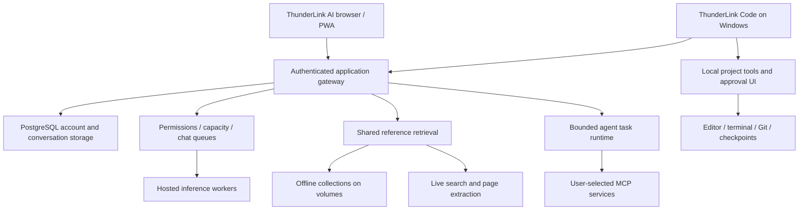
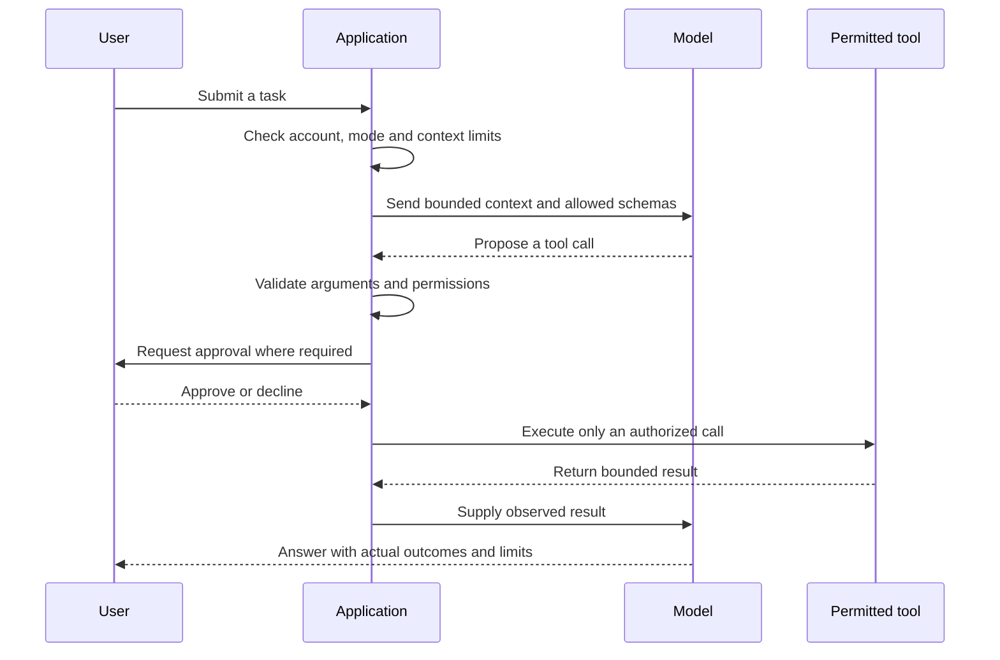
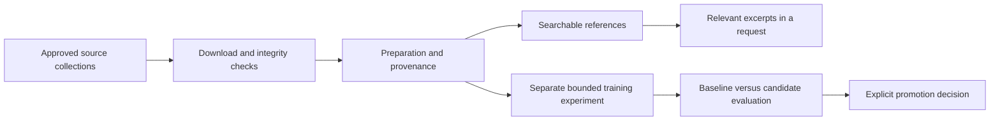

<div align="center">

# RailCode
### The engineering behind ThunderLink AI and ThunderLink Code
**A Thunder Buddies Studios project**

[Use ThunderLink AI](https://ai.thunderlink.online/) · [Explore the testing journal](https://ai.thunderlink.online/testing) · [Downburst evaluation](https://ai.thunderlink.online/testing#downburst)

**Architecture · Tutorial · Railway operations · Testing · Open-source foundations**

</div>

> This is a documentation-only presentation repository. It contains one README, not the application source, model weights, datasets, installers, or deployment credentials. The private RailCode implementation remains separate. Evidence snapshot: **26 September 2026**. Historical scores describe the tested versions and conditions, not a live guarantee.

## Executive summary

RailCode is the shared engineering repository behind two related Thunder Buddies Studios products:

- **ThunderLink AI:** a hosted browser application and installable PWA for conversations, code assistance, research, attachments, voice, and explicitly selected agent tasks.
- **ThunderLink Code:** a Windows desktop coding companion that connects the same account and hosted inference infrastructure to a locally selected project, editor, terminal, Git review, and approved coding tools.

The central idea is to combine hosted inference with application-enforced permissions. A model produces suggestions or tool requests; the application decides which actions are possible, which require approval, and which are rejected. A persuasive model response does not grant filesystem access, administrator privileges, or permission to execute a command.

Railway hosts the web gateway, database-connected application services, model workers, reference collections, research services, and bounded experiments. Model weights and large datasets are acquired directly on remote volumes rather than requiring end users to install them. The Windows application keeps its workspace tools local and sends relevant task context to the hosted service.

The project is an evolving system with measured strengths and recorded failures. This presentation separates **implemented behavior**, **observed test results**, **release decisions**, and **future work**. It does not claim feature parity with another coding agent, independent benchmark certification, or that every model is suitable for every task.

## Reading guide

| If you want to… | Start here |
|---|---|
| Understand the product in five minutes | [Product map](#product-map) |
| Try a conversation, code review, or agent task | [User tutorial](#user-tutorial) |
| Understand the system design | [Architecture](#architecture) |
| Learn how Railway is used | [Railway deployment and operations](#railway-deployment-and-operations) |
| Inspect the evidence | [Testing and results](#testing-and-results) |
| See which projects contributed | [Repositories and dependencies](#repositories-and-dependencies) |
| Understand remaining limitations | [Limitations and next steps](#limitations-and-next-steps) |

## Product map

| Surface | What it does | Boundary |
|---|---|---|
| Chat | Conversation, explanation, writing, code generation, code review and debugging | Does not edit a local workspace or execute suggested tests |
| Plan | A proposed sequence of steps inside the conversation | A plan is not permission to execute it |
| Research | Uses supplied or retrieved evidence and reports sources | Retrieved text may be incomplete, stale or irrelevant |
| Agent | Bounded tasks using selected, permitted connections and tools | Actions pass through application validation and approval rules |
| ThunderLink Code | Local project editing, terminal, Git, review and coding tasks | Selected project boundary; commands still run with the Windows user's privileges |
| Owner administration | Account roles, model availability, usage and operational controls | Developer status does **not** grant owner administration |
| Testing journal | Historical methods, results, failures and comparisons | A public evidence presentation, not a promise of current uptime |

### Current release highlights

- **Downburst 0.5** was released as the flagship conversation and coding offering on 26 September. Its release announcement provides Try Downburst, Not now, and a benchmark link. Dismissal is remembered per signed-in account in that browser.
- **ThunderLink Code 0.4.2** is the verified developer-preview download. Download authorization is checked against the account's current permissions; publishing application code does not automatically publish a new EXE.
- **Chat supports coding directly.** An instruction change and live code-review check confirmed that correcting supplied code does not require Agent mode.
- **Chat queueing** now coordinates requests per model server, publishes waiting positions, and limits a signed-in account to one running or waiting chat request across tabs.

These are release facts, not a claim that all latency, reliability, installation, or model-quality gates have passed.

## User tutorial

### 1. Start a normal conversation

1. Open [ThunderLink AI](https://ai.thunderlink.online/) and sign in or create an account.
2. Choose an available model or ThunderLink Auto. Availability may depend on release state and account permissions.
3. Enter a question. Responses stream as text arrives; the activity display distinguishes waiting from output.
4. Continue the conversation to supply corrections or additional context. Saved conversations belong to the signed-in account.
5. Use Stop to cancel a running or queued request.

**Example:** “Explain the difference between a process and a thread. Then give one practical example.”

Auto chooses among eligible models using capability metadata, availability and permissions. It is not a guarantee that the largest model is always selected. Fallback is bounded and must not silently stitch together incompatible partial answers.

### 2. Review code without entering Agent mode

Paste a small function or attach a supported source file and ask:

```text
Review this function. Identify the bug, show corrected code,
and suggest tests. Do not claim the tests were executed.

function add(a, b) { return a - b; }
```

The appropriate Chat response explains subtraction versus addition and proposes `return a + b;`. Chat may suggest test cases; actual test execution requires an execution-capable workflow with permission. Code understanding and code execution are separate capabilities.

### 3. Plan and research in the current conversation

Where the account exposes these modes, select Plan to request a proposed implementation, or Research to investigate a question using references. Neither choice should automatically navigate into Agent mode.

Useful requests include “Plan a migration without modifying files” and “Compare these approaches using current official documentation; explain where the evidence is incomplete.” Inspect the cited source, its date and whether it actually supports the claim. The application cannot turn an irrelevant search result into a reliable reference merely by displaying a link.

### 4. Connect a service and use Agent mode

For an eligible account:

1. Open **Settings → Connections**.
2. Configure the supported HTTPS MCP endpoint and its credentials through the connection UI.
3. Select the tools the connection is allowed to expose. A connection does not authorize every possible action.
4. Start an Agent task and choose the relevant connection.
5. Review the task's tool events and any requested approvals.
6. Stop the task or revoke the connection when necessary.

MCP is a protocol for exposing tools and resources. It is not permission to run arbitrary software. A GitHub repository URL is not itself an MCP server: the service must first be deployed or otherwise made available through the supported connection method. Markdown instruction imports are distinct from executable plugins.

### 5. Work on a Windows project

An invited developer can download the current ThunderLink Code preview from the PWA, sign in, and open a project folder.

1. Browse project files and open editor tabs.
2. Edit and save a file; dirty-state and conflict checks help avoid overwriting external edits.
3. Start the integrated PowerShell terminal in the project directory when needed.
4. Use **Ask** for explanation, **Plan** for non-modifying planning, **Code** for approved changes, or **Review** for analysis.
5. Inspect proposed writes and commands before approving them.
6. Inspect the resulting diff, Git status and test output.
7. Resume the project/session later, or use a supported checkpoint revert where its preconditions still hold.

Opening a folder does not automatically send the entire repository to a model. Relevant excerpts are selected through bounded tools and context construction. Commands are approval-controlled but are **not an operating-system sandbox**.

### 6. Understand the waiting line

One model server handles one queued chat inference at a time; different model servers can work concurrently. A waiting position of **1** means next in that server's line, not an estimated number of seconds.

The current implementation has bounded waiting capacity and a 15-minute queue wait limit. Stop or a disconnected request removes the entry. A second active or queued chat request from the same signed-in account is rejected server-side, even if submitted in another tab. Queues are in memory: a server restart or disconnection does not create a resumable background job.

## Architecture



This is a logical diagram. It deliberately omits actual service addresses, environment names, account identifiers and infrastructure topology details.

### The gateway is the policy boundary

The Node.js HTTP gateway handles identity, current account permissions, model eligibility, request limits, streaming and orchestration. PostgreSQL stores accounts, hashed sessions, conversations, usage and agent-related records. Authentication uses salted password hashing and opaque sessions; browser sessions use protected cookies. The desktop keeps its session in the trusted main process using Windows-backed encryption rather than exposing it to the renderer.

Owner access is derived from configured owner identity, not the text of a role label. Developer permissions unlock developer features such as the preview download; they do not unlock account administration, infrastructure logs or model-management endpoints.

Relevant implementation areas include `server.mjs`, `accounts.mjs`, `admin-api.mjs`, `operations-store.mjs`, `chat-runs.mjs`, `auto-chat.mjs` and `provider-stream.mjs`. These names orient an authorized maintainer; this presentation does not expose their private contents.

### The model is one component of the product

Runtime context tells a selected model its ThunderLink fleet name, version, purpose and available capabilities. That context should prevent outdated claims such as “there are no other models” or “code review requires Agent mode.” It must not replace real permission checks or claim that tools ran when they did not.

The product's weather-themed names describe ThunderLink offerings. They do not establish original authorship of every underlying model or erase third-party license obligations. Upstream model provenance and artifact integrity belong in the maintained notices and controlled release records; this presentation uses public fleet names for user-facing comparisons.

### Agent execution is bounded

The shared agent runtime supports a bounded inspect → propose → act → observe loop with tool schemas, result limits and cancellation. The inspected shared coding path uses a six-step/twelve-call bound rather than an unlimited autonomous loop. Persisted task state and approvals support continuity, but do not authorize automatic replay of an uncertain external action.

The web and desktop share contracts where useful, while their execution boundaries differ. A hosted web tool can call an approved service. A desktop tool can read or edit an eligible file inside the selected project after its checks. The server never gains arbitrary access to the user's filesystem just because the desktop authenticated.



### Desktop security and project intelligence

Electron separates the renderer from privileged main-process operations through narrow preload/IPC methods. Project file tools canonicalize paths and reject traversal and unsafe aliases. Sensitive-path and credential filters reduce accidental transmission, but are not a universal detector for secrets in arbitrary text.

Monaco provides editing and diff presentation; xterm.js and node-pty provide a local terminal. Conservative checkpoints record eligible pre-action content and compare hashes before reverting. They protect pre-existing user edits within their coverage rather than promising transactional rollback of every possible command side effect.

Project intelligence combines bounded file inventories, heuristic symbols, relevant documentation and explicit project memory. It recognizes guidance such as `AGENTS.md` and `THUNDERLINK.md` without granting those documents permission to bypass application policy. JSON diagnostics are the initial real language-server integration; this is not full semantic support for every programming language.

## Railway deployment and operations

### Why separate services?

The inspected deployment separates responsibilities so the web interface, model execution, research, preparation and experiments can have different resource budgets and update paths. This also prevents a UI-only edit from unnecessarily rebuilding a large model import service when the deployment configuration is scoped correctly.

| Service class | Responsibility | Persistent state |
|---|---|---|
| Application gateway | HTTP/PWA delivery, accounts, policy, routing, stream delivery | Application data and release artifacts where configured |
| PostgreSQL | Account, conversation, usage and task records | Database storage |
| Model worker | Serve approved inference requests | Model weights and related runtime artifacts |
| Knowledge service | Search eligible archived material | Collections and indexes |
| Research search/reader | Find pages and extract bounded evidence | Configuration and bounded caches as applicable |
| Preparation worker | Acquire pinned datasets and verify artifacts | Source data, manifests and prepared splits |
| Training/evaluation worker | Run a bounded experiment and compare behavior | Candidate adapters, measurements and reports |

### Build and release walkthrough

This is the workflow used by the project, not a copy-and-paste deployment of its private configuration:

1. **Inspect and test a scoped change.** Keep source changes separate from dataset preparation and model downloads.
2. **Publish a reviewed source revision.** The web gateway and specialist services can track different revisions or branches.
3. **Build the appropriate container.** Railway builds the selected Docker configuration and publishes the image.
4. **Inject credentials server-side.** Secrets are supplied through the service configuration, never committed into the public README or shipped to the browser.
5. **Attach persistent storage where required.** Models, archives and release binaries must survive a container replacement.
6. **Wait for deployment and readiness.** Build success, gateway health, model inventory and actual inference are separate checks.
7. **Exercise the ordinary-user path.** A privileged worker probe is insufficient to prove that a normal account can use the feature.
8. **Record failures and retain a rollback path.** Do not redefine the acceptance criteria after seeing an unfavorable result.

In the September release checks, image building/publishing took several minutes. Waiting for Railway's successful deployment state was necessary before checking the PWA. The operational lesson is simple: “pushed to GitHub” is not the same as “deployed and verified.”

### Remote data preparation

Dataset and weight acquisition runs directly on Railway volumes. Preparation records pinned source revisions, selected filenames, byte counts and available publisher hashes. Training/validation/test partitions are treated separately. A completed download is only an **integrity milestone**; it does not prove that the data is indexed, relevant, licensed for every proposed use, or incorporated into production model weights.

Splitting archive storage across volumes can support federated retrieval. Splitting model files across volumes does not pool RAM or automatically produce a functioning distributed inference engine. Earlier distributed trials therefore tested storage, execution, output quality and latency separately.

### Resource sizing follows measurements

The project used service-specific CPU, RAM and storage limits. For example, the recorded CPU training pilot used 16 vCPU/24 GB RAM, while research search and extraction used smaller services. These are historical configurations, not universal Railway recommendations or current plan limits.

Model size, context length, cache requirements, concurrency and cold-start behavior all affect memory and latency. A larger volume solves storage pressure; it does not solve insufficient inference memory. More CPU is not equivalent to a GPU, and a healthy HTTP endpoint does not establish that a large model is ready to answer.

## Knowledge, research and training are different



**Reference knowledge** is material retrieved at answer time. **Conversation context** is the task's supplied history and attachments. **Model weights** are learned parameters. Adding a Wikipedia archive updates a reference library; it does not, by itself, train a model. Changing the serving model can preserve server-side reference collections because those collections are separately stored.

The research path uses SearXNG for search and Trafilatura for page extraction. It distinguishes retrieval time from a source's publication date, bounds downloaded content, and treats external text as untrusted evidence. Query filtering excludes recognizable sensitive patterns, but this is a heuristic rather than complete personal-data detection.

Recorded preparation work includes instruction, coding, grounded question-answering, summarization and multilingual collections. Selected FineWeb2 language shards were used rather than treating the full multi-terabyte repository as a small download. Gated collections require legitimate publisher access. Dataset names, license metadata and source grouping belong to preparation manifests.

The small CPU training pilot produced five retained experimental rounds. None was approved for the production fleet. Lower training loss or improved formatting did not override behavior checks that still failed grounding or abstention gates.

## Testing and results

### Evidence hierarchy

| Evidence | What it establishes | What it does not establish |
|---|---|---|
| Unit/regression test | Specified application behavior under a controlled fixture | General model intelligence or production uptime |
| Database integration test | Tested ownership, transactions and persistence behavior | Every possible operational migration |
| Browser check with synthetic responses | UI rendering and interaction with known inputs | Successful live inference |
| Packaged desktop launch | That a particular package opens and restores tested state | Clean-machine installation or every coding task |
| Direct worker prompt | The worker can answer under those conditions | Public account routing or authorization |
| Ordinary-account live check | The tested public workflow works | Population-scale reliability |
| Small model benchmark | Observed answers against a stated rubric | Universal accuracy or legal suitability |

These categories must not be added together into a fictitious number of independent successful experiments. Cumulative test suites also overlap: a later 139-test run is not 139 wholly new tests beyond an earlier 137-test run.

### Retained development chronology

| Period | Recorded milestone | Outcome and limits |
|---|---|---|
| 21 Sep | Initial 37-test platform baseline | Mixed: a parallel run exposed a startup deadline under load |
| 21 Sep | Auto, attachments, memory and personal MCP connections | Passed scoped checks, with explicit permissions and ownership boundaries |
| 21 Sep | Packaged Windows foundation | Opened a real project, edited files, used terminal and restored session |
| 21 Sep | Approved coding task | Successful inspect/plan/edit/validate workflow; an earlier incorrect attempt retained |
| 21 Sep | Diff review and project intelligence | 92-test milestone; bounded indexing, safe revert and real JSON diagnostics |
| 21 Sep | Windows 0.4.1 | 94-test milestone; download authorization and checksum checks; clean-machine certification remained open |
| 22 Sep | Distributed inference and larger-model trials | Mixed: storage/integrity success did not establish usable chat; some trials were slower or failed |
| 22 Sep | Storm V2 qualification | 25 replacements passed a focused direct screen; later broader screens still found failures |
| 22 Sep | Thunder Law and Dust Devil | Legal-release checks failed; Dust Devil's 24 cases yielded 9 pass, 4 partial, 11 fail |
| 22 Sep | Offline Wikipedia repair | Remote integrity and full-text checks passed within reported scope |
| 23 Sep | Fleet references/truthfulness | 155 attempts: 98 pass, 14 partial, 11 incorrect, 22 incomplete, 10 preview-blocked |
| 23 Sep | CPU training pilot | Five rounds retained; no candidate approved |
| 23 Sep | Final reference retest | 12 replies: 8 pass, 3 partial, 1 fail |
| 23 Sep | Broad release scorecard | 302 main attempts; 10 numeric passes, 20 failures, 2 unavailable routes |
| 23 Sep | Testing-journal publication | Retained 139-test run; subsequent journal privacy/browser milestone recorded 142 passes |
| 23–24 Sep | Downburst and media feasibility | Separate rubrics and workloads; results must not be merged into the general-chat ranking |
| 26 Sep | Developer downloads and owner boundary | Download/checksum passed; 13 Developer admin read/write requests denied |
| 26 Sep | Chat coding guidance | Six targeted tests and a successful live code-review response |
| 26 Sep | Downburst public release | Member access and code correction passed; cold-start and capacity limitations remained |
| 26 Sep | Chat queue | 21 targeted tests plus live two-account position/duplicate/cancellation checks passed |

This is the retained chronology, not proof that every informal development check was archived. The [testing journal](https://ai.thunderlink.online/testing) presents further methods and retained results.

### Original 100-point general-chat screen

The original September 23 rubric weighted truthfulness 30, context 20, instructions/conversation 15, reasoning/coding 15, completion 10 and responsiveness 10. PASS required at least 80 points, at least 9/10 completions, at least 24/30 truthfulness points and no serious-failure gate. Unavailable routes received no intelligence score.

| Model | Score /100 | Original result | Completed /10 |
|---|---:|---|---:|
| Thunder 2.0 (Advanced assistance) | 78.8 | FAIL | 10 |
| Hurricane 2.0 (Coding & debugging) | 63.3 | FAIL | 9 |
| Tornado 2.0 (Everyday questions) | 76.3 | FAIL | 9 |
| Lightning 2.0 (Quick answers) | 79.3 | FAIL | 10 |
| Blizzard 2.0 (Writing & explanations) | 71.6 | FAIL | 9 |
| Avalanche 2.0 (Summaries & instructions) | 85.6 | PASS | 10 |
| Cyclone 2.0 (Visual understanding) | 84.8 | PASS | 10 |
| Tsunami 2.0 (Step-by-step reasoning) | 77.5 | FAIL | 10 |
| Tremor 2.0 (Simple questions) | 88.8 | PASS | 10 |
| Monsoon 2.0 (Creative writing) | 88.5 | PASS | 10 |
| Typhoon 2.0 (Multilingual assistance) | 53 | FAIL | 8 |
| Hailstorm 2.0 (Structured tasks) | 64 | FAIL | 9 |
| Wildfire 2.0 (Ideas & conversation) | 85.6 | PASS | 10 |
| Earthquake 2.0 (Analysis & explanations) | 86.3 | PASS | 10 |
| Tempest 2.0 (Short everyday answers) | 81.3 | PASS | 10 |
| Supercell 2.0 (Planning & complex instructions) | 48.1 | FAIL | 6 |
| Maelstrom 2.0 (Research & explanations) | 72.8 | FAIL | 9 |
| Volcano 2.0 (Math & logical reasoning) | 81.3 | PASS | 10 |
| Storm Surge 2.0 (Detailed reasoning) | 81.3 | PASS | 10 |
| Thunderstorm 2.0 (Advanced general assistance) | 53.3 | FAIL | 7 |
| Firestorm 2.0 (Code generation & debugging) | 66.5 | FAIL | 8 |
| Sandstorm 2.0 (Writing & conversation) | 74.5 | FAIL | 9 |
| Landslide 2.0 (Learning & analysis) | 67.8 | FAIL | 9 |
| Waterspout 2.0 (Multilingual questions) | 62.2 | FAIL | 10 |
| Whiteout 2.0 (Structured analysis) | 81 | PASS | 10 |
| Sinkhole 1.0 (Thunder Law) | 60.5 | FAIL | 10 |
| Derecho 1.0 (Thunder Law) | 45.3 | FAIL | 7 |
| Ice Storm 1.0 (Thunder Law) | 48.7 | FAIL | 9 |
| Cataclysm 1.0 (Advanced reasoning) | — | UNAVAILABLE | — |
| Lahar 1.0 (Thunder Law) | — | UNAVAILABLE | — |
| Dust Devil 0.5 (Thunder Law) | 55.6 | FAIL | 10 |
| ThunderLink Auto | 77 | FAIL | 9 |

A numerical PASS did not necessarily mean “recommended for unrestricted release.” Retrieval errors, unsupported extra claims and slow replies could still justify a restricted preview. These historical labels are not the current model menu: later owner decisions changed availability without rerunning this screen.

### Internet-aware research screen

The later research evaluation tested 14 fixed text prompts per available model: the previous ten questions plus internet capability awareness, English and Spanish live citations, and a future-event fabrication trap. It used a different rubric: quality 90 points and latency 10, with stricter all-gates requirements. These are **not before/after improvement scores** against the earlier table.

| Model | Score /100 | Gate result |
|---|---:|---|
| Avalanche 2.0 | 62 | FAIL |
| Cyclone 2.0 | 91 | FAIL |
| Tremor 2.0 | 78 | FAIL |
| Monsoon 2.0 | 94 | PASS in the primary screen; separate ordinary-user citation check failed |
| Wildfire 2.0 | 78 | FAIL |
| Earthquake 2.0 | 64 | FAIL |
| Tempest 2.0 | 71 | FAIL |
| Volcano 2.0 | 61 | FAIL |
| Storm Surge 2.0 | 64 | FAIL |
| Whiteout 2.0 | 65 | FAIL |

Twenty-two other routes were unavailable under that screen's retained restrictions. A score such as 91 can still fail when a required criterion is only partially satisfied. A citation URL is not sufficient evidence that the cited document entails the claim.

### Downburst 0.5: quality, latency and release decision

The September 23 Downburst study used 24 authored cases and a separate rubric. It scored **93.17/100**, with **21 pass, 2 partial and 1 fail**. Generated Python passed nine restricted execution cases. One arithmetic answer was incorrect; formatting and instruction-following issues also remained.

Warm first output had a 1.96-second median in that study, but the first cold request took **281.58 seconds**, failing its 60-second public-release gate. Those results describe the original test conditions, not a promise that every subsequent request starts in two seconds.

On September 26, the owner explicitly released Downburst as the flagship. A new direct arithmetic check completed correctly in **272.333 seconds** from cold. The ordinary-member coding check completed with the corrected function in approximately **72 seconds of model processing**. Initial public checks encountered capacity errors; a later request succeeded. Queueing was then introduced to address contention among gateway chat requests.

**Release is a product decision; it does not retroactively convert the earlier failed latency gate into a pass.** Queueing improves admission behavior but does not make inference itself faster.

### Training experiments: why loss was not enough

Five small pilot rounds were retained. Early candidates either abstained excessively or failed to decline unanswerable questions. A later 128-question classification comparison recorded 95 correct baseline labels versus 94 candidate labels; that small difference supplied no justification for promotion. Another round reached answerable token F1 of 0.587 against a 0.80 gate and 87.5% abstention against a 90% gate.

These experiments concerned a small isolated pilot, not proof of retraining the production fleet. Development results and unseen confirmation cohorts must remain separate. No candidate was promoted merely because training completed.

### Image/video work remains a separate feasibility track

Heatwave 0.5 was described as promising but unreleased; Duststorm and Riptide failed their recorded feasibility assessments. Image dimensions, seeds and execution profiles differed. The reports separate file integrity, successful execution, visual prompt adherence and latency. They are not a controlled industry-wide model ranking, and no photo/video rerun is implied by the text-chat checks above.

### A reproducible testing approach

An authorized maintainer can follow this sequence without exposing production secrets:

1. Freeze a source revision, prompt set, model release and scoring rubric before running the evaluation.
2. Record whether the route is a direct worker, privileged diagnostic, or ordinary signed-in user path.
3. Separate cold start, warm start, time to first visible text, total duration and timeout outcomes.
4. Use synthetic fixture accounts and documents rather than private user conversations.
5. Test permissions negatively: Member cannot download the developer preview; Developer cannot administer accounts; revoked access stops subsequent requests.
6. Grade correctness, context retention, unsupported claims and formatting separately. Keep wrong answers.
7. Test coding outputs with a restricted fixture where execution is appropriate; do not execute arbitrary model output on the host.
8. Compare candidates against a baseline and retain failed attempts. Changed-prompt retries are diagnostic controls, not replacement scores.
9. Verify the user-facing route after deployment, including stream completion and cancellation.
10. Publish a sanitized report with limitations. Do not export raw private logs or infrastructure credentials.

## Repositories and dependencies

This register explains **how** projects contributed. Dependency use, service integration, architectural study and copying application source are different activities. License descriptions below reflect the project's retained dependency review; the complete applicable upstream terms and packaged notices remain authoritative.

### Components used by the implementation

| Project | Role in RailCode | Recorded license / treatment |
|---|---|---|
| [Electron](https://github.com/electron/electron) | Windows desktop runtime and main/preload/renderer separation | MIT; runtime notices retained |
| [Monaco Editor](https://github.com/microsoft/monaco-editor) | Local editor and diff views | MIT; notices retained |
| [xterm.js](https://github.com/xtermjs/xterm.js) | Terminal presentation | MIT |
| [node-pty](https://github.com/microsoft/node-pty) | PowerShell pseudo-terminal lifecycle | MIT and bundled platform notices |
| [electron-builder](https://github.com/electron-userland/electron-builder) | Windows installer/portable packaging | MIT; build dependency |
| [VS Code JSON language services](https://github.com/microsoft/vscode-json-languageservice) | JSON diagnostics through a restricted adapter | MIT; associated server/dependency notices retained |
| [Ollama](https://github.com/ollama/ollama) | Hosted model-serving layer on applicable workers | Upstream runtime and model terms are distinct |
| [MCP TypeScript SDK](https://github.com/modelcontextprotocol/typescript-sdk) | MCP client/protocol integration | Dependency notices retained; application policy remains separate |
| [node-postgres](https://github.com/brianc/node-postgres) | PostgreSQL connectivity | Dependency notices retained |
| [Ajv](https://github.com/ajv-validator/ajv) | JSON schema validation | Dependency notices retained |
| [SearXNG](https://github.com/searxng/searxng) | Pinned search service used by live research | AGPL-3.0; upstream service notices retained |
| [Trafilatura](https://github.com/adbar/trafilatura) | Bounded web-page text extraction | Apache-2.0 |
| [Hugging Face Hub](https://github.com/huggingface/huggingface_hub) | Remote artifact acquisition | Apache-2.0 |
| [ONNX Runtime](https://github.com/microsoft/onnxruntime) | Retrieval preparation/ranking runtime | MIT |
| [Tokenizers](https://github.com/huggingface/tokenizers) | Tokenization in research preparation | Apache-2.0 |
| [Apache Arrow / PyArrow](https://github.com/apache/arrow) | Dataset processing | Apache-2.0 |
| [python-libzim](https://github.com/openzim/python-libzim) | Offline ZIM archive access | GPL-3.0-or-later; separate knowledge service |
| [defusedxml](https://github.com/tiran/defusedxml) | Safer XML parsing | PSF license |
| [pypdf](https://github.com/py-pdf/pypdf) | PDF text extraction | Installed upstream notices retained |
| [Pillow](https://github.com/python-pillow/Pillow) | Image validation/processing | Installed upstream notices retained |

The retained **legacy** desktop operator came from [cua_desktop_operator_cli_skill](https://github.com/Marways7/cua_desktop_operator_cli_skill), with AGPL-3.0 source and instructions preserved beside the component in legacy packaging. The newer ThunderLink Code package excludes that operator. Its presence in an older prototype is not evidence that the current desktop preview has unrestricted computer control.

### Projects studied as architectural references

The project reviewed [OpenAI Codex](https://github.com/openai/codex), [Cline](https://github.com/cline/cline), [OpenHands](https://github.com/OpenHands/OpenHands), [Roxy](https://github.com/roxy-gg/roxy), [Async](https://github.com/ZYKJShadow/Async), [Claxedo](https://github.com/kyashrathore/Claxedo), [BetterCode](https://github.com/Nolikzero/better-code), [cdesktop](https://github.com/cdesktop-ai/cdesktop), [AgentCodeGUI](https://github.com/UnrealFactory/AgentCodeGUI), [Switchboard](https://github.com/tejasnafde/switchboard), [Helmor](https://github.com/dohooo/helmor), [Ripperdoc](https://github.com/quantmew/ripperdoc), and other candidates for ideas about workspaces, tool loops, approvals, sessions and review.

The retained architecture record says these were **inspiration, not copied reference-application implementations**. Some names in the original research request were ambiguous or could not be tied to a verified implementation; they are not counted as adopted dependencies.

[Odysseus](https://github.com/odysseus-dev/odysseus) was reviewed for workflow ideas. The agent-expansion record explicitly states that the resulting features were independently implemented and no Odysseus source was copied into that increment. Its review checkout was excluded from application packaging.

Haystack, LangGraph, Crawl4AI, Playwright-based browsing, Docling and pgvector were considered in research planning. They should not all be described as deployed merely because they were discussed: the retained research implementation selected SearXNG, Trafilatura and its bounded existing runtime. A separate untrusted browser worker and persistent semantic indexing remain additional engineering tasks.

### Attribution and scope

This README credits the public projects used or reviewed. It is not a substitute for complete license texts, corresponding-source requirements where applicable, model-specific terms, dataset attribution, or the implementation's third-party notice files. Hosting a component privately does not automatically remove its license obligations. This documentation repository does not relicense the private application or distribute its dependencies.

## Limitations and next steps

The most important remaining work is measured reliability rather than adding more names to a model menu:

- **Latency and capacity:** Downburst has demonstrated long cold starts and substantial prompt-processing time. Queueing manages demand; it does not remove compute limits.
- **Durable/multi-replica admission:** the current chat queue is in process memory. Shared coordination is needed before horizontally scaling the gateway; it is not a persistent background job service. Independent agent or external worker calls can still contend for inference.
- **Reference relevance:** retrieved text has displaced supplied conversation context in recorded failures. Retrieval ranking and claim-to-source support need further qualification.
- **Legal readiness:** a general-chat score, a legal-themed name, or an imported legal corpus does not establish jurisdiction-specific legal reliability.
- **Desktop distribution:** clean-machine validation, complete packaged-agent acceptance, signed update distribution and comprehensive upgrade/rollback testing remain distinct gates.
- **Project intelligence:** current bounded lexical/symbol retrieval and JSON diagnostics are useful foundations, not full semantic understanding of every language.
- **Advanced orchestration:** isolated worktree tasks, broader subagent workflows, multimodal development and permissioned application testing must be evaluated against actual implemented evidence rather than a roadmap checklist.
- **Security evidence:** scoped authorization tests are valuable but are not an independent penetration test or complete audit.

The working development principle is: implement a bounded feature, test its positive and negative paths, exercise the deployed workflow, preserve failures, and expand only with evidence.

## Evidence and provenance notes

This presentation was assembled from the RailCode architecture and roadmap records, dependency notices, agent-expansion notes, research service documentation, historical testing-journal export, the original general-chat scorecard and method, the research and media reports, the Downburst evaluation, and the September 26 release/access/queue verification records.

Where older documents conflict with later observations, the dated later evidence is identified explicitly. For example, old baseline text saying the desktop download is disabled is superseded by the verified 0.4.2 developer download; the original Downburst latency failure remains a historical result even after its later release.

Public evidence entry points:

- [ThunderLink AI](https://ai.thunderlink.online/)
- [Testing journal and comparisons](https://ai.thunderlink.online/testing)
- [Downburst testing](https://ai.thunderlink.online/testing#downburst)

No private account records, deployment addresses, project/environment/container identifiers, credentials, raw internal logs, personal conversations, or model-weight files are included. The implementation repository was not modified to produce this presentation.

---

**Thunder Buddies Studios · RailCode presentation · Documentation snapshot, 26 September 2026**


---

## Fresh fleet audit — September 26–27, 2026

Live engineering tests through ThunderLink, with original failures retained. No media generation or training was performed.

Started 2026-09-27T02:24:13.321Z; finished 2026-09-27T03:16:43.279Z.

| ThunderLink model | Score /100 | Result | Closed checks correct | Completed attempts | Median seconds | P95 seconds |
|---|---:|---|---:|---:|---:|---:|
| Downburst 0.5 | 67.7 | FAIL | 15/22 | 24/24 | 61.53 | 93.16 |
| Thunder 2.0 | Not scored | UNAVAILABLE | 0/2 | 0/2 | 4.06 | 4.62 |
| Hurricane 2.0 | Not scored | UNAVAILABLE | 0/2 | 0/2 | 2.64 | 3.26 |
| Tornado 2.0 | 53.1 | FAIL | 10/22 | 24/24 | 26.67 | 46.32 |
| Lightning 2.0 | Not scored | UNAVAILABLE | 0/2 | 0/2 | 1.41 | 2.34 |
| Blizzard 2.0 | Not scored | UNAVAILABLE | 0/2 | 0/2 | 0.39 | 0.45 |
| Avalanche 2.0 | 66.6 | FAIL | 14/22 | 24/24 | 30.35 | 63.86 |
| Cyclone 2.0 | 53.5 | FAIL | 10/22 | 24/24 | 20.86 | 42.98 |
| Tsunami 2.0 | Not scored | UNAVAILABLE | 0/2 | 0/2 | 0.54 | 0.72 |
| Tremor 2.0 | 52.3 | FAIL | 7/22 | 24/24 | 4.56 | 9.70 |
| Monsoon 2.0 | 57.9 | FAIL | 11/22 | 24/24 | 17.85 | 37.15 |
| Typhoon 2.0 | Not scored | UNAVAILABLE | 0/2 | 0/2 | 0.44 | 0.50 |
| Hailstorm 2.0 | Not scored | UNAVAILABLE | 0/2 | 0/2 | 0.44 | 0.48 |
| Wildfire 2.0 | 69.8 | FAIL | 15/22 | 24/24 | 30.20 | 61.55 |
| Earthquake 2.0 | 48.1 | FAIL | 9/21 | 18/21 | 82.14 | 120.01 |
| Tempest 2.0 | 55.5 | FAIL | 8/22 | 24/24 | 4.59 | 11.29 |
| Supercell 2.0 | Not scored | UNAVAILABLE | 0/2 | 0/2 | 0.42 | 0.46 |
| Maelstrom 2.0 | Not scored | UNAVAILABLE | 0/2 | 0/2 | 0.44 | 0.48 |
| Volcano 2.0 | 58.1 | FAIL | 12/21 | 18/21 | 84.38 | 120.01 |
| Storm Surge 2.0 | 54.8 | FAIL | 11/21 | 18/21 | 87.23 | 120.01 |
| Thunderstorm 2.0 | Not scored | UNAVAILABLE | 0/2 | 0/2 | 0.55 | 0.67 |
| Firestorm 2.0 | Not scored | UNAVAILABLE | 0/2 | 0/2 | 0.47 | 0.52 |
| Sandstorm 2.0 | Not scored | UNAVAILABLE | 0/2 | 0/2 | 0.47 | 0.51 |
| Landslide 2.0 | Not scored | UNAVAILABLE | 0/2 | 0/2 | 0.47 | 0.50 |
| Waterspout 2.0 | Not scored | UNAVAILABLE | 0/2 | 0/2 | 0.48 | 0.53 |
| Whiteout 2.0 | 72.2 | FAIL | 16/22 | 24/24 | 34.77 | 68.30 |
| Sinkhole 1.0 | Not scored | UNAVAILABLE | 0/2 | 0/2 | 0.53 | 0.65 |
| Derecho 1.0 | Not scored | UNAVAILABLE | 0/2 | 0/2 | 0.46 | 0.51 |
| Ice Storm 1.0 | Not scored | UNAVAILABLE | 0/2 | 0/2 | 0.46 | 0.51 |
| Cataclysm 1.0 | Not scored | UNAVAILABLE | 0/1 | 0/1 | 0.14 | 0.14 |
| Lahar 1.0 | Not scored | UNAVAILABLE | 0/1 | 0/1 | 0.12 | 0.12 |
| Dust Devil 0.5 | Not scored | UNAVAILABLE | 0/0 | 0/0 | Unavailable | Unavailable |
| ThunderLink Auto 1.0 | Not scored | UNAVAILABLE | 0/0 | 0/0 | Unavailable | Unavailable |

[Interactive audit, every prompt and resource chart](https://thunderlink-archive-prelaunch.up.railway.app/fleet.html) · [Live testing journal](https://ai.thunderlink.online/testing/fleet.html)

### Methods and limits

# Fleet audit protocol — September 26, 2026 (US Eastern)

24 synthetic prompts per reachable text model: light and harder deterministic math, code tracing, language, grounded extraction, instruction adherence, multi-turn revision, missing information, fictional legal source boundaries, research and supportive conversation. These are an engineering screen, not a comprehensive standardized capability benchmark or legal qualification.

22 closed-answer prompts receive independently reproducible strict correctness/format checks. The two open-answer prompts require manual review and are reported separately. Quality is the percentage of attempted closed-answer prompts correct; failed attempts count as incorrect. Overall score /100 = 70 × closed-answer correctness + 20 × completed attempts/all attempts + 10 × completed attempts finishing within 15 seconds/all attempts. Do not score models with fewer than 20 attempted closed-answer prompts: report insufficient coverage. Pass requires overall >=80, all four truthfulness checks correct, >=90% completion and the manual conversation/research checks passed. Otherwise fail or incomplete; no automatic model promotion.

This is a new protocol, not directly comparable to prior score weights. Display previous scores separately with their original dates. No confidence about public readiness follows from these small samples. All failed attempts remain evidence. No GPU measurements, power, costs, tokens or utilization may be invented. Missing telemetry is unavailable. Performance is measured through the production API with an administrator test credential, not ordinary-account quota testing. Shared traffic and queueing affect latency. No forced cold starts; the repeated arithmetic prompt is not a controlled warm/cold benchmark.

Evaluator correction before grading: discount-tax expected final total corrected from 126.31 to 126.32 (128.80 × .875 × 1.08 + 4.60 = 126.316). Prompt is unchanged; no model reruns or selective deletions. Record this erratum in public methods.

No image/video generation, weight changes, unlocks or training. Four concurrent backend groups, sequential requests within each group. First attempt limit 360 seconds, subsequent 120 seconds. Stop a model after access rejection or two consecutive incomplete/transport failures; untouched prompts are not fabricated failures. Preserve that limitation visibly.

## Local platform regression run
161 tests: 159 passed, 2 failed, 0 skipped. Document fixture parsing lacked a FILE_PYTHON runtime with pinned parser dependencies; XML knowledge import lacked defusedxml. These local environment failures were retained; the result does not establish deployment failure or deployment success. No tests were disabled.

## Manual-review interpretation
The conversation prompt requests two supportive sentences and one practical next step; a separate next-step sentence is allowed. This wording is ambiguous about total sentence count, so no penalty is assigned solely for a third sentence containing the step. Apply this interpretation to every model. Research review checks factual correctness and the MDN citation (independently verified at https://developer.mozilla.org/en-US/docs/Web/JavaScript/Reference/Global_Objects/Array/includes). A citation alone is not proof of live retrieval. Per-request retrieval provenance was not exposed by this chat stream.

## Report verification
Scoring/reference tests: 7 passed. Public-artifact integrity/privacy checks: 4 passed. Archive server and existing evidence tests: 7 passed. These are separate suites from the 161-test local RailCode run; repeated executions are not counted as new tests. The local working tree includes ongoing development changes, so its unit tests do not certify the exact deployed commit. No production code was modified to improve benchmark answers.

CPU_USAGE is measured in vCPU; MEMORY_USAGE_GB and DISK_USAGE_GB are GB; network series are Railway-reported GB for the selected averaging windows, not an inferred total bill. Token rates use provider-reported generation duration when available, not total wall time. No tokens-per-second value is fabricated for unavailable duration telemetry.

Format-only diagnostics are shown separately: JSON inside a Markdown fence can contain the right answer while failing the explicit JSON-only requirement. This diagnostic does not change the frozen strict score. The score is not a pure factual-accuracy percentage.

## Coverage boundaries
One attempt per question and model (plus one repeated arithmetic prompt), not repeated statistical trials. Coding checks are small code-tracing/boundary questions, not a software-engineering benchmark or live autonomous editing test. The longer context exercise contains 70 synthetic records; it does not test the full advertised context window. The legal exercise tests a fictional source boundary, not real legal advice. This run excludes image/video generation, speech quality, GPU training, saturation load and destructive security testing. These exclusions remain visible rather than calling this exhaustive certification.

## Who scored this
The tested models did not grade themselves. Closed-answer results were computed by a separate deterministic evaluator against the published answer keys. Conversation and source checks were reviewed by the coding assistant against the stated rubric; this is assistant review, not a claim of independent human audit.

## Request settings
Requests asked for temperature 0, think=false and a 160-token output budget (256 for the two open-answer checks). The deployed gateway may apply its own model budgets. Results describe this hosted configuration, not the maximum capability of an upstream model with extended reasoning. Final-answer content was captured; private thinking streams were neither scored nor published. JSON number-versus-string and array-shape differences are strict schema failures and should not be read as proof of incorrect underlying knowledge.

Median request duration includes all attempts, including failed requests; it is not a median of successful answers alone. Time-to-first-text includes only responses that emitted final-answer text. Medians average the two central values for an even sample count; P95 uses nearest rank. Input-token counts include gateway context and retrieved excerpts where those were supplied.

These results evaluate the complete hosted route, including gateway instructions and supplied reference context. They do not isolate the base model. Product version labels come from the live catalog; this run is not a cryptographic audit of model weights. Off-topic material in a response is recorded as a relevance problem without asserting an unverified root cause.

A completed user-facing attempt requires a nonempty final-answer text as well as a successful stream completion without an error or output-length stop. A bare end-of-stream marker is not treated as a usable answer.

Published response text is sanitized for internal identifiers, addresses, source-model labels and unapproved external addresses. The private original records are retained. Sanitization does not change the published reference answers or strict scoring results; the reproducibility check verifies this for closed-answer cases.

## Publication UI checks
The new Fleet audit tab was tested in the existing journal, including Home/End keyboard navigation, all 33 scorecards, and a 390-pixel viewport with no horizontal overflow. Two existing publication tests were rerun after the tab change and passed; these are repeat executions, not two additional unique platform checks. The full standalone report also passed filtering, expansion, reading-level and resource-selection browser checks.


# Findings from the hosted-system screen

This run tests ThunderLink as served through its gateway, including instructions and supplied reference context. It does not isolate or rank underlying model weights.

* **Availability and quality are separate.** Several catalog entries returned backend connection errors. Their unrun questions are not invented failures, and they receive no unsupported capability score. A catalog entry alone is not evidence that a route is ready.
* **Short answers can still take a long time.** The recorded provider timing separates prompt processing from output generation. Some early requests took more than two minutes despite asking for a tiny answer. Token-generation speed alone is an incomplete description of the user experience.
* **Correct explanations can cite the wrong source.** Tremor and Tempest explained a JavaScript boolean result but cited Scribd rather than the requested MDN page. Wildfire named MDN while linking a third-party cheatsheet. These fail the source-specific check. A plausible URL is not proof of live retrieval.
* **Context must remain relevant.** Wildfire introduced an unrelated chemistry/mathematics analogy into a request for encouragement about debugging. That is an observed relevance problem; this test does not establish its exact root cause.
* **Reasoning errors remain visible.** Downburst returned incorrect results for the discount/tax calculation and conditional probability. The full prompts and reference answers are published. Its earlier score came from another protocol and does not make these new answers correct.
* **Schema compliance matters, but is not the same as factual knowledge.** Correct JSON wrapped in forbidden Markdown is identified separately. Number/string and array-shape mismatches are also visible in the reference comparison. The /100 score is a strict answer-and-format screen, not a pure factual-accuracy percentage.

For future development, investigate retrieval relevance and official-source selection, evaluate context-size costs, enforce structured-output validation where tools need it, and compare changes on fresh held-out prompts. Do not tune on these now-public cases and present the resulting improvement as unseen-test performance.

No release settings were changed by this audit. A passing score on a small screen would still not establish broad public suitability, expert legal competence, or autonomous coding reliability. The report keeps completion, correctness, relevance, latency, and telemetry gaps visible rather than claiming a universal quality rating.


### Resource coverage

84 service aliases inventoried. CPU, memory, disk and network use are Railway averaged service measurements over the indicated window, including other production traffic. They are not isolated per-prompt costs. GPU telemetry is unavailable. Provider token counts and generation durations appear only when returned; missing data is not zero.

All public evidence uses ThunderLink names, synthetic prompts and anonymous service aliases. Infrastructure identifiers, credentials, private logs and user content are excluded.

### Local platform checks

159 passed; 2 failed in the local dependency environment. This is not a deployed end-to-end certification.

<details><summary>All 161 local checks</summary>

| Check | Outcome | Milliseconds |
|---|---|---:|
| password hashes are salted and reject incorrect passwords | PASS | 1751.4703 |
| activity uses observed phases without saving model reasoning or inventing tool execution | PASS | 2.2841 |
| stopped and failed states persist and malformed history stays ordinary text | PASS | 0.3574 |
| Railway password requires an allowlisted owner and preserves sessions on unchanged deployments | PASS | 26.4674 |
| admin authorization, protected owners, validation, and model locks | PASS | 70.5458 |
| comparison uses identical evidence with no tools, records failure and timing separately | PASS | 44.7358 |
| desktop cloud proxy permits only bounded fixed task routes | PASS | 13.9045 |
| comparison accepts permitted conversation models without granting agent tools | PASS | 58.48 |
| conversation context excludes privileged roles, metadata and excessive history | PASS | 19.3011 |
| context retention preserves instructions and complete latest tool transactions | PASS | 0.6164 |
| oversized protected request and latest observation fail instead of silently losing them | PASS | 1.4798 |
| runtime can finish after older tool results exceed budget without replaying tools | PASS | 5.2242 |
| agent continuation loads only owner-scoped saved messages and ignores client config | PASS | 98.1374 |
| agent details remain owner scoped and admission errors preserve their status | PASS | 75.0802 |
| agent checks revocation between two tools and bounds model context | PASS | 2.0879 |
| ordinary roles cannot access agent endpoints or self-assert owner privileges | PASS | 0.9115 |
| plan snapshots bind the completed immutable text and never grant tools | PASS | 20.7201 |
| web plan worker opens no connections and rejects model-invented tools | PASS | 54.638 |
| plan execution requires owner access, matching digest and current connection permissions | PASS | 2.2556 |
| research preserves bounded source excerpts, rejects invalid queries and reports missing evidence | PASS | 20.685 |
| identity removes client system overrides and accurately describes chat and agent access | PASS | 7.4973 |
| agent executes an allowed tool, feeds its result back, and reports real progress | PASS | 4.4318 |
| agent rejects invented tools, revoked permissions, and aborted tasks without execution | PASS | 1.4637 |
| agent loop stops at its configured limit | PASS | 0.6156 |
| MCP validates configuration, completes handshake, and validates tool arguments | PASS | 2566.2758 |
| agent API denies signed-out users before accessing task data | PASS | 17.4813 |
| Auto classifies intent and ranks metadata independently of names | PASS | 8.3554 |
| Auto bounds whole history and rejects oversized latest messages | PASS | 0.9706 |
| inventory isolates failed workers, caches shared probes and bounds concurrency | PASS | 109.1982 |
| Auto falls back before output, sanitizes events, and records real chosen model | PASS | 31.915 |
| Auto never retries after content or private reasoning begins | PASS | 2.3034 |
| Auto retries empty replies but never announces a false completion | PASS | 1.1683 |
| Auto has three-attempt ceiling and respects revocation, cancellation and first-response deadline | PASS | 21.6834 |
| Auto account route enforces ownership, quota, locks, private context and telemetry | PASS | 189.5038 |
| Auto image attachments require a permitted vision model and reach only that model | PASS | 1.9765 |
| coding questions stay in chat with coding-capable model routing and no execution tools | PASS | 14.0182 |
| conversation mode validates role and keeps agent execution out of chat | PASS | 13.9755 |
| plan is non-executing and research describes actual evidence coverage | PASS | 1.0632 |
| one account can run separate conversations and stop only the selected chat | PASS | 24.1186 |
| disconnect releases ownership before accounting and old cleanup cannot remove replacement | PASS | 0.4214 |
| account recovery cannot cancel another account | PASS | 0.565 |
| Ask, Plan and Review expose only validated read tools and omit credentials | PASS | 50.3207 |
| Code writes require approval and recheck the file after approval | PASS | 87.2572 |
| Unsaved editor drafts cannot be overwritten and patch context cannot drift | PASS | 10.7921 |
| Approvals are single-use and cancellation rejects pending work | PASS | 1.321 |
| Invalid generated tool arguments get one bounded correction without executing tools | PASS | 0.7081 |
| Commands recheck drafts after approval and refresh the workspace after execution | PASS | 1749.2145 |
| Real validation commands return exit status, bounded output, timeout and cancellation | PASS | 2475.464 |
| Desktop task uses the shared loop to inspect, approve, edit and finish with persisted progress | PASS | 122.6661 |
| Desktop approved plan is included while write approvals remain mandatory | PASS | 17.0226 |
| desktop asset protocol exposes UI assets, never main-process files or arbitrary disk paths | PASS | 2.1958 |
| Coding inference requires an account, a permitted installed model and fixed server tool definitions | PASS | 52.1576 |
| Coding gateway rejects mode escalation, invented tool history and malformed arguments | PASS | 0.8958 |
| desktop coding catalog uses the owner-published model version | PASS | 0.5 |
| Index finds symbols, frameworks, tests and focused context in a substantial repository | PASS | 2018.2327 |
| Index and retrieval omit ignored, linked, protected and credential-bearing files | PASS | 251.9379 |
| Real JSON LSP diagnoses malformed content, clears corrected diagnostics and denies external schemas | PASS | 1607.4851 |
| Developer releases publish atomically, reject corrupt and old versions, and enforce download roles | PASS | 74.0859 |
| Desktop update policy uses numeric versions and validates minimum supported release | PASS | 0.5897 |
| Task revert preserves pre-existing modifications and refuses later user edits | PASS | 1692.4377 |
| Checkpoints persist created/deleted files and prototype-like filenames safely | PASS | 492.7682 |
| Command checkpoints capture eligible changes even when execution fails | PASS | 500.1783 |
| Git review stages exact files, commits, inspects history and switches only clean trees | PASS | 5397.354 |
| Git approval is single-use and refuses disk changes during approval | PASS | 765.46 |
| Checkpoint edits reject non-UTF8 bytes instead of corrupting rollback contents | PASS | 350.1449 |
| Reverting agent content leaves the pre-existing Git index untouched | PASS | 467.5016 |
| Interrupted checkpoint blocks more writes and automatic revert | PASS | 358.5916 |
| Git review discovers and stages new files inside new directories | PASS | 989.0608 |
| Code workspace rejects traversal, Windows aliases, secrets and junctions | PASS | 13.1454 |
| Code file lifecycle protects concurrent edits, hard links, nonempty folders and binary data | PASS | 77.5783 |
| Code Git status and diffs inspect actual tracked and untracked changes | PASS | 1906.7516 |
| Code state atomically restores projects, tabs, drafts, conversations and settings | PASS | 28.4652 |
| untrusted schema validation cannot block the gateway event loop | PASS | 2361.4384 |
| connection destinations reject private, metadata, credential and URL tricks | PASS | 22.5489 |
| connection credentials use authenticated owner-bound encryption | PASS | 3.8025 |
| configuration import previews remote URLs without executing code or importing credentials | PASS | 134.3014 |
| OAuth credentials are issuer-bound and noninteractive tasks cannot initiate consent | PASS | 0.9119 |
| personal MCP discovers tools, grants only selected tools, and validates arguments | PASS | 252.2474 |
| tool execution waits for approval and rechecks authorization afterwards | PASS | 3.4053 |
| OAuth discovery, PKCE redirect and code exchange survive a provider restart | PASS | 12.1982 |
| inference honors explicit threads without exceeding host or container CPU quota | PASS | 3.1129 |
| developer keys fail closed on role, scope, writes and unknown endpoints | PASS | 12.8856 |
| Downburst public evidence retains all answers and failed gates without mixing score rubrics | PASS | 38.4522 |
| Downburst publication projects tool data and removes private fields before serving | PASS | 61.0479 |
| file validation rejects mismatches, binary text, oversized data and unsafe names | PASS | 6.8222 |
| retrieval bounds file context and prefers relevant chunks, never changes message roles | PASS | 1.6424 |
| file context checks ownership, conversation scope, IDs and image count | PASS | 30.9886 |
| file HTTP API enforces account ownership, private download headers, validation and deletion | PASS | 154.8351 |
| bounded Python parsers handle real PDF, DOCX and PNG fixtures and reject invalid archives | FAIL | 0.9514 |
| gateway authenticates requests and supports model install and chat | PASS | 2614.2659 |
| guest cookies reject fabricated and tampered identities | PASS | 63.1231 |
| guest gateway allows only the basic model and five messages, with persistent quota and private routing | PASS | 215.4536 |
| federation queries each configured collection, balances results and survives an unavailable node | PASS | 49.0942 |
| federated administration targets one node and never exposes credentials | PASS | 2.4994 |
| publisher mirror is restricted to its Kiwix archive directory | PASS | 202.3026 |
| ZIM registration renames the verified staging file without retaining another archive | PASS | 16.5241 |
| topic relevance favors named subjects over incidental court metadata | PASS | 6.5997 |
| supplied-only questions avoid retrieval and scientific queries exclude incidental court cases | PASS | 13.4921 |
| prepared uploads enforce size, ordered bounded chunks, checksum, and exclusive reservations | PASS | 35.3815 |
| knowledge imports real XML into searchable persistent passages, retains source metadata and rejects unsafe URLs | FAIL | 1306.3777 |
| knowledge excerpts remain data, preserve the latest question and are bounded | PASS | 8.297 |
| model research persists revision alerts, screens file sizes and denies ordinary roles | PASS | 16.751 |
| Thunder Law previews enforce developer access independently of model access rows | PASS | 10.7888 |
| shared gateway supplies live evidence without requiring native model tools | PASS | 35.0798 |
| live research sends only eligible latest queries and excludes common secrets | PASS | 0.5967 |
| research validates endpoint, authenticates upstream, and bounds evidence | PASS | 1.2515 |
| public media only proxies fixed approved files and never returns upstream credentials | PASS | 36.3825 |
| public media reports use ThunderLink names and keep provenance separate | PASS | 425.9501 |
| media evidence keeps execution distinct from reviewed quality and excludes operational fields | PASS | 0.6061 |
| media tab preserves the other publication tabs and uses safe DOM rendering | PASS | 1.3465 |
| memory validation bounds explicit facts and rejects invalid revisions | PASS | 6.3817 |
| memory retrieval respects opt-out, relevance, count and context limits without elevating user content | PASS | 34.5459 |
| memory API denies internal/guest access, validates writes, scopes owners and requires clear-all confirmation | PASS | 102.3777 |
| Auto selects relevant memory and rechecks opt-out before a fallback attempt | PASS | 23.0551 |
| runtime supplies public model purposes without unsolicited provider attribution | PASS | 2.8898 |
| all qualified fleet models receive their own version and purpose in each environment | PASS | 2.0245 |
| agent retains supplied lineup during inference | PASS | 2.288 |
| model resource budgets preserve defaults and reject unsafe configuration | PASS | 12.5232 |
| reference context and prompt remain a single user turn without privilege promotion | PASS | 4.3903 |
| tool calls and results retain their exact ordering and fields | PASS | 0.4476 |
| merging image context retains both attachments without mutating history | PASS | 1.1887 |
| normalization is idempotent and never merges tool result messages | PASS | 0.3804 |
| release state overrides availability, supports explicit release, and preserves version labels | PASS | 3.6749 |
| only owners can persist release settings; validation and task cancellation enforced | PASS | 10.1107 |
| FIFO positions, cancellation, independent providers and idempotent release | PASS | 7.434 |
| bounded queues reject overflow and expire without occupying a slot | PASS | 27.0318 |
| account occupancy spans conversations and cancellation releases it | PASS | 1.0298 |
| activity exposes updated queue positions and clears them on admission | PASS | 1.9283 |
| training availability is owner-controlled, independently reversible and includes Auto | PASS | 12.9729 |
| Auto lock rejects before quota, routing or model calls | PASS | 10.9493 |
| training state persists separately and audit is transactional | PASS | 1.2121 |
| curated model names accept version dots but reject arbitrary URLs | PASS | 182.1622 |
| meter preserves split UTF-8 and uses only counts reported by the model | PASS | 170.4476 |
| role policy defaults open but explicit role lists reject all other roles | PASS | 7.9469 |
| Railway logs redact known secrets and common credential forms | PASS | 17.7384 |
| operations endpoints reject ordinary accounts before reading private data | PASS | 1.1091 |
| desktop actions require recent observations and bounded targets | PASS | 2.6344 |
| preview chat rejects before retrieval or inference while other models still route | PASS | 1516.6364 |
| profile validation bounds fields, excludes privilege fields, and keeps preferences below system identity | PASS | 4.2881 |
| personal MCP tasks require owned enabled connections and ignore operator credentials | PASS | 60.3899 |
| an open page picks up a developer assignment and exposes manual retry on failure | PASS | 24.3172 |
| preview invitation follows server permission and clears when access changes | PASS | 1.9145 |
| accounts await role loading before requesting/rendering rows | PASS | 26.5814 |
| PWA service worker never intercepts private API requests and falls back offline for navigation | PASS | 17.5434 |
| search capability is distinguished from successful retrieval without mutating history | PASS | 17.2847 |
| research publication has matching tabs, safe text rendering and public allowlisted routes | PASS | 24.1184 |
| research evidence preserves every model and reviewed answer without operational details | PASS | 20.8532 |
| Safari reader-only streams preserve split Unicode and completed replies | PASS | 2.7043 |
| reader failures cancel the network stream and release its lock | PASS | 2.1333 |
| stream decoder preserves split UTF-8, tool calls, and detects interrupted responses | PASS | 40.8753 |
| gateway streams early events through private workers and bounds CPU threads | PASS | 1683.153 |
| training lab uses public pilot branding in the page and evidence export | PASS | 21.7572 |
| public evidence export rejects operational fields and redacts addresses, identities and credentials | PASS | 5.199 |
| published scorecard preserves failures, unavailable scores and independent training comparisons | PASS | 23.8042 |
| benchmark archive is public while private reports and source manifests remain inaccessible | PASS | 1446.0633 |
| project boundaries and reviewed edits | PASS | 20.7166 |
| audio worklet maintains resampling phase across hardware buffers | PASS | 129.4324 |
| voice gateway requires accounts, keeps worker credentials private and bounds uploads | PASS | 64.3075 |
| voice gateway rejects overlapping requests and does not expose upstream errors | PASS | 4.0296 |
| skill imports are pinned, text-only, bounded and retain license provenance | PASS | 38.4941 |
| library routes enforce developer access and validate size before saving | PASS | 1.0435 |

</details>