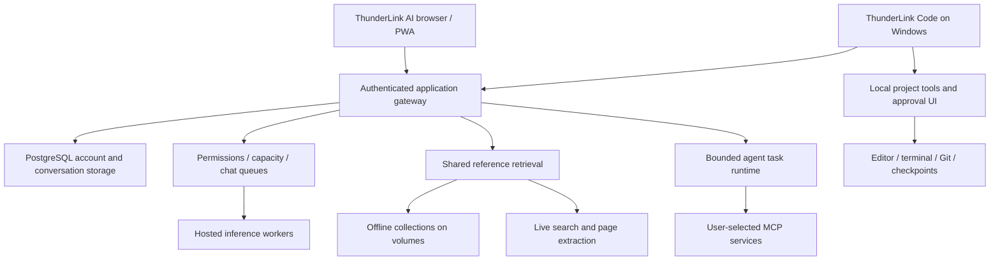
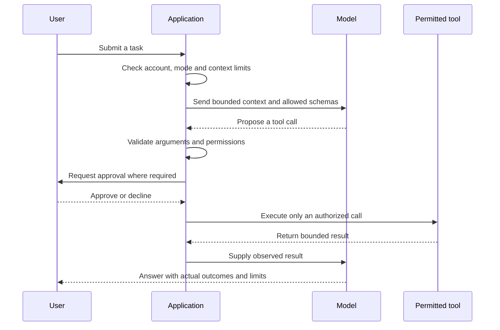
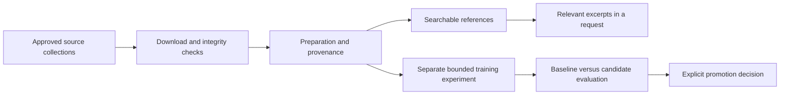

<div align="center">

# RailCode
### The engineering behind ThunderLink AI and ThunderLink Code
**A Thunder Buddies Studios project**

[Use ThunderLink AI](https://ai.thunderlink.online/) · [Explore the testing journal](https://ai.thunderlink.online/testing) · [Downburst evaluation](https://ai.thunderlink.online/testing#downburst)

**Architecture · Tutorial · Railway operations · Testing · Open-source foundations**

</div>

> This is a documentation-only presentation repository. It contains one README, not the application source, model weights, datasets, installers, or deployment credentials. The private RailCode implementation remains separate. Evidence snapshot: **26 September 2026**. Historical scores describe the tested versions and conditions, not a live guarantee.

## Executive summary

RailCode is the shared engineering repository behind two related Thunder Buddies Studios products:

- **ThunderLink AI:** a hosted browser application and installable PWA for conversations, code assistance, research, attachments, voice, and explicitly selected agent tasks.
- **ThunderLink Code:** a Windows desktop coding companion that connects the same account and hosted inference infrastructure to a locally selected project, editor, terminal, Git review, and approved coding tools.

The central idea is to combine hosted inference with application-enforced permissions. A model produces suggestions or tool requests; the application decides which actions are possible, which require approval, and which are rejected. A persuasive model response does not grant filesystem access, administrator privileges, or permission to execute a command.

Railway hosts the web gateway, database-connected application services, model workers, reference collections, research services, and bounded experiments. Model weights and large datasets are acquired directly on remote volumes rather than requiring end users to install them. The Windows application keeps its workspace tools local and sends relevant task context to the hosted service.

The project is an evolving system with measured strengths and recorded failures. This presentation separates **implemented behavior**, **observed test results**, **release decisions**, and **future work**. It does not claim feature parity with another coding agent, independent benchmark certification, or that every model is suitable for every task.

## Reading guide

| If you want to… | Start here |
|---|---|
| Understand the product in five minutes | [Product map](#product-map) |
| Try a conversation, code review, or agent task | [User tutorial](#user-tutorial) |
| Understand the system design | [Architecture](#architecture) |
| Learn how Railway is used | [Railway deployment and operations](#railway-deployment-and-operations) |
| Inspect the evidence | [Testing and results](#testing-and-results) |
| See which projects contributed | [Repositories and dependencies](#repositories-and-dependencies) |
| Understand remaining limitations | [Limitations and next steps](#limitations-and-next-steps) |

## Product map

| Surface | What it does | Boundary |
|---|---|---|
| Chat | Conversation, explanation, writing, code generation, code review and debugging | Does not edit a local workspace or execute suggested tests |
| Plan | A proposed sequence of steps inside the conversation | A plan is not permission to execute it |
| Research | Uses supplied or retrieved evidence and reports sources | Retrieved text may be incomplete, stale or irrelevant |
| Agent | Bounded tasks using selected, permitted connections and tools | Actions pass through application validation and approval rules |
| ThunderLink Code | Local project editing, terminal, Git, review and coding tasks | Selected project boundary; commands still run with the Windows user's privileges |
| Owner administration | Account roles, model availability, usage and operational controls | Developer status does **not** grant owner administration |
| Testing journal | Historical methods, results, failures and comparisons | A public evidence presentation, not a promise of current uptime |

### Current release highlights

- **Downburst 0.5** was released as the flagship conversation and coding offering on 26 September. Its release announcement provides Try Downburst, Not now, and a benchmark link. Dismissal is remembered per signed-in account in that browser.
- **ThunderLink Code 0.4.2** is the verified developer-preview download. Download authorization is checked against the account's current permissions; publishing application code does not automatically publish a new EXE.
- **Chat supports coding directly.** An instruction change and live code-review check confirmed that correcting supplied code does not require Agent mode.
- **Chat queueing** now coordinates requests per model server, publishes waiting positions, and limits a signed-in account to one running or waiting chat request across tabs.

These are release facts, not a claim that all latency, reliability, installation, or model-quality gates have passed.

## User tutorial

### 1. Start a normal conversation

1. Open [ThunderLink AI](https://ai.thunderlink.online/) and sign in or create an account.
2. Choose an available model or ThunderLink Auto. Availability may depend on release state and account permissions.
3. Enter a question. Responses stream as text arrives; the activity display distinguishes waiting from output.
4. Continue the conversation to supply corrections or additional context. Saved conversations belong to the signed-in account.
5. Use Stop to cancel a running or queued request.

**Example:** “Explain the difference between a process and a thread. Then give one practical example.”

Auto chooses among eligible models using capability metadata, availability and permissions. It is not a guarantee that the largest model is always selected. Fallback is bounded and must not silently stitch together incompatible partial answers.

### 2. Review code without entering Agent mode

Paste a small function or attach a supported source file and ask:

```text
Review this function. Identify the bug, show corrected code,
and suggest tests. Do not claim the tests were executed.

function add(a, b) { return a - b; }
```

The appropriate Chat response explains subtraction versus addition and proposes `return a + b;`. Chat may suggest test cases; actual test execution requires an execution-capable workflow with permission. Code understanding and code execution are separate capabilities.

### 3. Plan and research in the current conversation

Where the account exposes these modes, select Plan to request a proposed implementation, or Research to investigate a question using references. Neither choice should automatically navigate into Agent mode.

Useful requests include “Plan a migration without modifying files” and “Compare these approaches using current official documentation; explain where the evidence is incomplete.” Inspect the cited source, its date and whether it actually supports the claim. The application cannot turn an irrelevant search result into a reliable reference merely by displaying a link.

### 4. Connect a service and use Agent mode

For an eligible account:

1. Open **Settings → Connections**.
2. Configure the supported HTTPS MCP endpoint and its credentials through the connection UI.
3. Select the tools the connection is allowed to expose. A connection does not authorize every possible action.
4. Start an Agent task and choose the relevant connection.
5. Review the task's tool events and any requested approvals.
6. Stop the task or revoke the connection when necessary.

MCP is a protocol for exposing tools and resources. It is not permission to run arbitrary software. A GitHub repository URL is not itself an MCP server: the service must first be deployed or otherwise made available through the supported connection method. Markdown instruction imports are distinct from executable plugins.

### 5. Work on a Windows project

An invited developer can download the current ThunderLink Code preview from the PWA, sign in, and open a project folder.

1. Browse project files and open editor tabs.
2. Edit and save a file; dirty-state and conflict checks help avoid overwriting external edits.
3. Start the integrated PowerShell terminal in the project directory when needed.
4. Use **Ask** for explanation, **Plan** for non-modifying planning, **Code** for approved changes, or **Review** for analysis.
5. Inspect proposed writes and commands before approving them.
6. Inspect the resulting diff, Git status and test output.
7. Resume the project/session later, or use a supported checkpoint revert where its preconditions still hold.

Opening a folder does not automatically send the entire repository to a model. Relevant excerpts are selected through bounded tools and context construction. Commands are approval-controlled but are **not an operating-system sandbox**.

### 6. Understand the waiting line

One model server handles one queued chat inference at a time; different model servers can work concurrently. A waiting position of **1** means next in that server's line, not an estimated number of seconds.

The current implementation has bounded waiting capacity and a 15-minute queue wait limit. Stop or a disconnected request removes the entry. A second active or queued chat request from the same signed-in account is rejected server-side, even if submitted in another tab. Queues are in memory: a server restart or disconnection does not create a resumable background job.

## Architecture



This is a logical diagram. It deliberately omits actual service addresses, environment names, account identifiers and infrastructure topology details.

### The gateway is the policy boundary

The Node.js HTTP gateway handles identity, current account permissions, model eligibility, request limits, streaming and orchestration. PostgreSQL stores accounts, hashed sessions, conversations, usage and agent-related records. Authentication uses salted password hashing and opaque sessions; browser sessions use protected cookies. The desktop keeps its session in the trusted main process using Windows-backed encryption rather than exposing it to the renderer.

Owner access is derived from configured owner identity, not the text of a role label. Developer permissions unlock developer features such as the preview download; they do not unlock account administration, infrastructure logs or model-management endpoints.

Relevant implementation areas include `server.mjs`, `accounts.mjs`, `admin-api.mjs`, `operations-store.mjs`, `chat-runs.mjs`, `auto-chat.mjs` and `provider-stream.mjs`. These names orient an authorized maintainer; this presentation does not expose their private contents.

### The model is one component of the product

Runtime context tells a selected model its ThunderLink fleet name, version, purpose and available capabilities. That context should prevent outdated claims such as “there are no other models” or “code review requires Agent mode.” It must not replace real permission checks or claim that tools ran when they did not.

The product's weather-themed names describe ThunderLink offerings. They do not establish original authorship of every underlying model or erase third-party license obligations. Upstream model provenance and artifact integrity belong in the maintained notices and controlled release records; this presentation uses public fleet names for user-facing comparisons.

### Agent execution is bounded

The shared agent runtime supports a bounded inspect → propose → act → observe loop with tool schemas, result limits and cancellation. The inspected shared coding path uses a six-step/twelve-call bound rather than an unlimited autonomous loop. Persisted task state and approvals support continuity, but do not authorize automatic replay of an uncertain external action.

The web and desktop share contracts where useful, while their execution boundaries differ. A hosted web tool can call an approved service. A desktop tool can read or edit an eligible file inside the selected project after its checks. The server never gains arbitrary access to the user's filesystem just because the desktop authenticated.



### Desktop security and project intelligence

Electron separates the renderer from privileged main-process operations through narrow preload/IPC methods. Project file tools canonicalize paths and reject traversal and unsafe aliases. Sensitive-path and credential filters reduce accidental transmission, but are not a universal detector for secrets in arbitrary text.

Monaco provides editing and diff presentation; xterm.js and node-pty provide a local terminal. Conservative checkpoints record eligible pre-action content and compare hashes before reverting. They protect pre-existing user edits within their coverage rather than promising transactional rollback of every possible command side effect.

Project intelligence combines bounded file inventories, heuristic symbols, relevant documentation and explicit project memory. It recognizes guidance such as `AGENTS.md` and `THUNDERLINK.md` without granting those documents permission to bypass application policy. JSON diagnostics are the initial real language-server integration; this is not full semantic support for every programming language.

## Railway deployment and operations

### Why separate services?

The inspected deployment separates responsibilities so the web interface, model execution, research, preparation and experiments can have different resource budgets and update paths. This also prevents a UI-only edit from unnecessarily rebuilding a large model import service when the deployment configuration is scoped correctly.

| Service class | Responsibility | Persistent state |
|---|---|---|
| Application gateway | HTTP/PWA delivery, accounts, policy, routing, stream delivery | Application data and release artifacts where configured |
| PostgreSQL | Account, conversation, usage and task records | Database storage |
| Model worker | Serve approved inference requests | Model weights and related runtime artifacts |
| Knowledge service | Search eligible archived material | Collections and indexes |
| Research search/reader | Find pages and extract bounded evidence | Configuration and bounded caches as applicable |
| Preparation worker | Acquire pinned datasets and verify artifacts | Source data, manifests and prepared splits |
| Training/evaluation worker | Run a bounded experiment and compare behavior | Candidate adapters, measurements and reports |

### Build and release walkthrough

This is the workflow used by the project, not a copy-and-paste deployment of its private configuration:

1. **Inspect and test a scoped change.** Keep source changes separate from dataset preparation and model downloads.
2. **Publish a reviewed source revision.** The web gateway and specialist services can track different revisions or branches.
3. **Build the appropriate container.** Railway builds the selected Docker configuration and publishes the image.
4. **Inject credentials server-side.** Secrets are supplied through the service configuration, never committed into the public README or shipped to the browser.
5. **Attach persistent storage where required.** Models, archives and release binaries must survive a container replacement.
6. **Wait for deployment and readiness.** Build success, gateway health, model inventory and actual inference are separate checks.
7. **Exercise the ordinary-user path.** A privileged worker probe is insufficient to prove that a normal account can use the feature.
8. **Record failures and retain a rollback path.** Do not redefine the acceptance criteria after seeing an unfavorable result.

In the September release checks, image building/publishing took several minutes. Waiting for Railway's successful deployment state was necessary before checking the PWA. The operational lesson is simple: “pushed to GitHub” is not the same as “deployed and verified.”

### Remote data preparation

Dataset and weight acquisition runs directly on Railway volumes. Preparation records pinned source revisions, selected filenames, byte counts and available publisher hashes. Training/validation/test partitions are treated separately. A completed download is only an **integrity milestone**; it does not prove that the data is indexed, relevant, licensed for every proposed use, or incorporated into production model weights.

Splitting archive storage across volumes can support federated retrieval. Splitting model files across volumes does not pool RAM or automatically produce a functioning distributed inference engine. Earlier distributed trials therefore tested storage, execution, output quality and latency separately.

### Resource sizing follows measurements

The project used service-specific CPU, RAM and storage limits. For example, the recorded CPU training pilot used 16 vCPU/24 GB RAM, while research search and extraction used smaller services. These are historical configurations, not universal Railway recommendations or current plan limits.

Model size, context length, cache requirements, concurrency and cold-start behavior all affect memory and latency. A larger volume solves storage pressure; it does not solve insufficient inference memory. More CPU is not equivalent to a GPU, and a healthy HTTP endpoint does not establish that a large model is ready to answer.

## Knowledge, research and training are different



**Reference knowledge** is material retrieved at answer time. **Conversation context** is the task's supplied history and attachments. **Model weights** are learned parameters. Adding a Wikipedia archive updates a reference library; it does not, by itself, train a model. Changing the serving model can preserve server-side reference collections because those collections are separately stored.

The research path uses SearXNG for search and Trafilatura for page extraction. It distinguishes retrieval time from a source's publication date, bounds downloaded content, and treats external text as untrusted evidence. Query filtering excludes recognizable sensitive patterns, but this is a heuristic rather than complete personal-data detection.

Recorded preparation work includes instruction, coding, grounded question-answering, summarization and multilingual collections. Selected FineWeb2 language shards were used rather than treating the full multi-terabyte repository as a small download. Gated collections require legitimate publisher access. Dataset names, license metadata and source grouping belong to preparation manifests.

The small CPU training pilot produced five retained experimental rounds. None was approved for the production fleet. Lower training loss or improved formatting did not override behavior checks that still failed grounding or abstention gates.

## Testing and results

### Evidence hierarchy

| Evidence | What it establishes | What it does not establish |
|---|---|---|
| Unit/regression test | Specified application behavior under a controlled fixture | General model intelligence or production uptime |
| Database integration test | Tested ownership, transactions and persistence behavior | Every possible operational migration |
| Browser check with synthetic responses | UI rendering and interaction with known inputs | Successful live inference |
| Packaged desktop launch | That a particular package opens and restores tested state | Clean-machine installation or every coding task |
| Direct worker prompt | The worker can answer under those conditions | Public account routing or authorization |
| Ordinary-account live check | The tested public workflow works | Population-scale reliability |
| Small model benchmark | Observed answers against a stated rubric | Universal accuracy or legal suitability |

These categories must not be added together into a fictitious number of independent successful experiments. Cumulative test suites also overlap: a later 139-test run is not 139 wholly new tests beyond an earlier 137-test run.

### Retained development chronology

| Period | Recorded milestone | Outcome and limits |
|---|---|---|
| 21 Sep | Initial 37-test platform baseline | Mixed: a parallel run exposed a startup deadline under load |
| 21 Sep | Auto, attachments, memory and personal MCP connections | Passed scoped checks, with explicit permissions and ownership boundaries |
| 21 Sep | Packaged Windows foundation | Opened a real project, edited files, used terminal and restored session |
| 21 Sep | Approved coding task | Successful inspect/plan/edit/validate workflow; an earlier incorrect attempt retained |
| 21 Sep | Diff review and project intelligence | 92-test milestone; bounded indexing, safe revert and real JSON diagnostics |
| 21 Sep | Windows 0.4.1 | 94-test milestone; download authorization and checksum checks; clean-machine certification remained open |
| 22 Sep | Distributed inference and larger-model trials | Mixed: storage/integrity success did not establish usable chat; some trials were slower or failed |
| 22 Sep | Storm V2 qualification | 25 replacements passed a focused direct screen; later broader screens still found failures |
| 22 Sep | Thunder Law and Dust Devil | Legal-release checks failed; Dust Devil's 24 cases yielded 9 pass, 4 partial, 11 fail |
| 22 Sep | Offline Wikipedia repair | Remote integrity and full-text checks passed within reported scope |
| 23 Sep | Fleet references/truthfulness | 155 attempts: 98 pass, 14 partial, 11 incorrect, 22 incomplete, 10 preview-blocked |
| 23 Sep | CPU training pilot | Five rounds retained; no candidate approved |
| 23 Sep | Final reference retest | 12 replies: 8 pass, 3 partial, 1 fail |
| 23 Sep | Broad release scorecard | 302 main attempts; 10 numeric passes, 20 failures, 2 unavailable routes |
| 23 Sep | Testing-journal publication | Retained 139-test run; subsequent journal privacy/browser milestone recorded 142 passes |
| 23–24 Sep | Downburst and media feasibility | Separate rubrics and workloads; results must not be merged into the general-chat ranking |
| 26 Sep | Developer downloads and owner boundary | Download/checksum passed; 13 Developer admin read/write requests denied |
| 26 Sep | Chat coding guidance | Six targeted tests and a successful live code-review response |
| 26 Sep | Downburst public release | Member access and code correction passed; cold-start and capacity limitations remained |
| 26 Sep | Chat queue | 21 targeted tests plus live two-account position/duplicate/cancellation checks passed |

This is the retained chronology, not proof that every informal development check was archived. The [testing journal](https://ai.thunderlink.online/testing) presents further methods and retained results.

### Original 100-point general-chat screen

The original September 23 rubric weighted truthfulness 30, context 20, instructions/conversation 15, reasoning/coding 15, completion 10 and responsiveness 10. PASS required at least 80 points, at least 9/10 completions, at least 24/30 truthfulness points and no serious-failure gate. Unavailable routes received no intelligence score.

| Model | Score /100 | Original result | Completed /10 |
|---|---:|---|---:|
| Thunder 2.0 (Advanced assistance) | 78.8 | FAIL | 10 |
| Hurricane 2.0 (Coding & debugging) | 63.3 | FAIL | 9 |
| Tornado 2.0 (Everyday questions) | 76.3 | FAIL | 9 |
| Lightning 2.0 (Quick answers) | 79.3 | FAIL | 10 |
| Blizzard 2.0 (Writing & explanations) | 71.6 | FAIL | 9 |
| Avalanche 2.0 (Summaries & instructions) | 85.6 | PASS | 10 |
| Cyclone 2.0 (Visual understanding) | 84.8 | PASS | 10 |
| Tsunami 2.0 (Step-by-step reasoning) | 77.5 | FAIL | 10 |
| Tremor 2.0 (Simple questions) | 88.8 | PASS | 10 |
| Monsoon 2.0 (Creative writing) | 88.5 | PASS | 10 |
| Typhoon 2.0 (Multilingual assistance) | 53 | FAIL | 8 |
| Hailstorm 2.0 (Structured tasks) | 64 | FAIL | 9 |
| Wildfire 2.0 (Ideas & conversation) | 85.6 | PASS | 10 |
| Earthquake 2.0 (Analysis & explanations) | 86.3 | PASS | 10 |
| Tempest 2.0 (Short everyday answers) | 81.3 | PASS | 10 |
| Supercell 2.0 (Planning & complex instructions) | 48.1 | FAIL | 6 |
| Maelstrom 2.0 (Research & explanations) | 72.8 | FAIL | 9 |
| Volcano 2.0 (Math & logical reasoning) | 81.3 | PASS | 10 |
| Storm Surge 2.0 (Detailed reasoning) | 81.3 | PASS | 10 |
| Thunderstorm 2.0 (Advanced general assistance) | 53.3 | FAIL | 7 |
| Firestorm 2.0 (Code generation & debugging) | 66.5 | FAIL | 8 |
| Sandstorm 2.0 (Writing & conversation) | 74.5 | FAIL | 9 |
| Landslide 2.0 (Learning & analysis) | 67.8 | FAIL | 9 |
| Waterspout 2.0 (Multilingual questions) | 62.2 | FAIL | 10 |
| Whiteout 2.0 (Structured analysis) | 81 | PASS | 10 |
| Sinkhole 1.0 (Thunder Law) | 60.5 | FAIL | 10 |
| Derecho 1.0 (Thunder Law) | 45.3 | FAIL | 7 |
| Ice Storm 1.0 (Thunder Law) | 48.7 | FAIL | 9 |
| Cataclysm 1.0 (Advanced reasoning) | — | UNAVAILABLE | — |
| Lahar 1.0 (Thunder Law) | — | UNAVAILABLE | — |
| Dust Devil 0.5 (Thunder Law) | 55.6 | FAIL | 10 |
| ThunderLink Auto | 77 | FAIL | 9 |

A numerical PASS did not necessarily mean “recommended for unrestricted release.” Retrieval errors, unsupported extra claims and slow replies could still justify a restricted preview. These historical labels are not the current model menu: later owner decisions changed availability without rerunning this screen.

### Internet-aware research screen

The later research evaluation tested 14 fixed text prompts per available model: the previous ten questions plus internet capability awareness, English and Spanish live citations, and a future-event fabrication trap. It used a different rubric: quality 90 points and latency 10, with stricter all-gates requirements. These are **not before/after improvement scores** against the earlier table.

| Model | Score /100 | Gate result |
|---|---:|---|
| Avalanche 2.0 | 62 | FAIL |
| Cyclone 2.0 | 91 | FAIL |
| Tremor 2.0 | 78 | FAIL |
| Monsoon 2.0 | 94 | PASS in the primary screen; separate ordinary-user citation check failed |
| Wildfire 2.0 | 78 | FAIL |
| Earthquake 2.0 | 64 | FAIL |
| Tempest 2.0 | 71 | FAIL |
| Volcano 2.0 | 61 | FAIL |
| Storm Surge 2.0 | 64 | FAIL |
| Whiteout 2.0 | 65 | FAIL |

Twenty-two other routes were unavailable under that screen's retained restrictions. A score such as 91 can still fail when a required criterion is only partially satisfied. A citation URL is not sufficient evidence that the cited document entails the claim.

### Downburst 0.5: quality, latency and release decision

The September 23 Downburst study used 24 authored cases and a separate rubric. It scored **93.17/100**, with **21 pass, 2 partial and 1 fail**. Generated Python passed nine restricted execution cases. One arithmetic answer was incorrect; formatting and instruction-following issues also remained.

Warm first output had a 1.96-second median in that study, but the first cold request took **281.58 seconds**, failing its 60-second public-release gate. Those results describe the original test conditions, not a promise that every subsequent request starts in two seconds.

On September 26, the owner explicitly released Downburst as the flagship. A new direct arithmetic check completed correctly in **272.333 seconds** from cold. The ordinary-member coding check completed with the corrected function in approximately **72 seconds of model processing**. Initial public checks encountered capacity errors; a later request succeeded. Queueing was then introduced to address contention among gateway chat requests.

**Release is a product decision; it does not retroactively convert the earlier failed latency gate into a pass.** Queueing improves admission behavior but does not make inference itself faster.

### Training experiments: why loss was not enough

Five small pilot rounds were retained. Early candidates either abstained excessively or failed to decline unanswerable questions. A later 128-question classification comparison recorded 95 correct baseline labels versus 94 candidate labels; that small difference supplied no justification for promotion. Another round reached answerable token F1 of 0.587 against a 0.80 gate and 87.5% abstention against a 90% gate.

These experiments concerned a small isolated pilot, not proof of retraining the production fleet. Development results and unseen confirmation cohorts must remain separate. No candidate was promoted merely because training completed.

### Image/video work remains a separate feasibility track

Heatwave 0.5 was described as promising but unreleased; Duststorm and Riptide failed their recorded feasibility assessments. Image dimensions, seeds and execution profiles differed. The reports separate file integrity, successful execution, visual prompt adherence and latency. They are not a controlled industry-wide model ranking, and no photo/video rerun is implied by the text-chat checks above.

### A reproducible testing approach

An authorized maintainer can follow this sequence without exposing production secrets:

1. Freeze a source revision, prompt set, model release and scoring rubric before running the evaluation.
2. Record whether the route is a direct worker, privileged diagnostic, or ordinary signed-in user path.
3. Separate cold start, warm start, time to first visible text, total duration and timeout outcomes.
4. Use synthetic fixture accounts and documents rather than private user conversations.
5. Test permissions negatively: Member cannot download the developer preview; Developer cannot administer accounts; revoked access stops subsequent requests.
6. Grade correctness, context retention, unsupported claims and formatting separately. Keep wrong answers.
7. Test coding outputs with a restricted fixture where execution is appropriate; do not execute arbitrary model output on the host.
8. Compare candidates against a baseline and retain failed attempts. Changed-prompt retries are diagnostic controls, not replacement scores.
9. Verify the user-facing route after deployment, including stream completion and cancellation.
10. Publish a sanitized report with limitations. Do not export raw private logs or infrastructure credentials.

## Repositories and dependencies

This register explains **how** projects contributed. Dependency use, service integration, architectural study and copying application source are different activities. License descriptions below reflect the project's retained dependency review; the complete applicable upstream terms and packaged notices remain authoritative.

### Components used by the implementation

| Project | Role in RailCode | Recorded license / treatment |
|---|---|---|
| [Electron](https://github.com/electron/electron) | Windows desktop runtime and main/preload/renderer separation | MIT; runtime notices retained |
| [Monaco Editor](https://github.com/microsoft/monaco-editor) | Local editor and diff views | MIT; notices retained |
| [xterm.js](https://github.com/xtermjs/xterm.js) | Terminal presentation | MIT |
| [node-pty](https://github.com/microsoft/node-pty) | PowerShell pseudo-terminal lifecycle | MIT and bundled platform notices |
| [electron-builder](https://github.com/electron-userland/electron-builder) | Windows installer/portable packaging | MIT; build dependency |
| [VS Code JSON language services](https://github.com/microsoft/vscode-json-languageservice) | JSON diagnostics through a restricted adapter | MIT; associated server/dependency notices retained |
| [Ollama](https://github.com/ollama/ollama) | Hosted model-serving layer on applicable workers | Upstream runtime and model terms are distinct |
| [MCP TypeScript SDK](https://github.com/modelcontextprotocol/typescript-sdk) | MCP client/protocol integration | Dependency notices retained; application policy remains separate |
| [node-postgres](https://github.com/brianc/node-postgres) | PostgreSQL connectivity | Dependency notices retained |
| [Ajv](https://github.com/ajv-validator/ajv) | JSON schema validation | Dependency notices retained |
| [SearXNG](https://github.com/searxng/searxng) | Pinned search service used by live research | AGPL-3.0; upstream service notices retained |
| [Trafilatura](https://github.com/adbar/trafilatura) | Bounded web-page text extraction | Apache-2.0 |
| [Hugging Face Hub](https://github.com/huggingface/huggingface_hub) | Remote artifact acquisition | Apache-2.0 |
| [ONNX Runtime](https://github.com/microsoft/onnxruntime) | Retrieval preparation/ranking runtime | MIT |
| [Tokenizers](https://github.com/huggingface/tokenizers) | Tokenization in research preparation | Apache-2.0 |
| [Apache Arrow / PyArrow](https://github.com/apache/arrow) | Dataset processing | Apache-2.0 |
| [python-libzim](https://github.com/openzim/python-libzim) | Offline ZIM archive access | GPL-3.0-or-later; separate knowledge service |
| [defusedxml](https://github.com/tiran/defusedxml) | Safer XML parsing | PSF license |
| [pypdf](https://github.com/py-pdf/pypdf) | PDF text extraction | Installed upstream notices retained |
| [Pillow](https://github.com/python-pillow/Pillow) | Image validation/processing | Installed upstream notices retained |

The retained **legacy** desktop operator came from [cua_desktop_operator_cli_skill](https://github.com/Marways7/cua_desktop_operator_cli_skill), with AGPL-3.0 source and instructions preserved beside the component in legacy packaging. The newer ThunderLink Code package excludes that operator. Its presence in an older prototype is not evidence that the current desktop preview has unrestricted computer control.

### Projects studied as architectural references

The project reviewed [OpenAI Codex](https://github.com/openai/codex), [Cline](https://github.com/cline/cline), [OpenHands](https://github.com/OpenHands/OpenHands), [Roxy](https://github.com/roxy-gg/roxy), [Async](https://github.com/ZYKJShadow/Async), [Claxedo](https://github.com/kyashrathore/Claxedo), [BetterCode](https://github.com/Nolikzero/better-code), [cdesktop](https://github.com/cdesktop-ai/cdesktop), [AgentCodeGUI](https://github.com/UnrealFactory/AgentCodeGUI), [Switchboard](https://github.com/tejasnafde/switchboard), [Helmor](https://github.com/dohooo/helmor), [Ripperdoc](https://github.com/quantmew/ripperdoc), and other candidates for ideas about workspaces, tool loops, approvals, sessions and review.

The retained architecture record says these were **inspiration, not copied reference-application implementations**. Some names in the original research request were ambiguous or could not be tied to a verified implementation; they are not counted as adopted dependencies.

[Odysseus](https://github.com/odysseus-dev/odysseus) was reviewed for workflow ideas. The agent-expansion record explicitly states that the resulting features were independently implemented and no Odysseus source was copied into that increment. Its review checkout was excluded from application packaging.

Haystack, LangGraph, Crawl4AI, Playwright-based browsing, Docling and pgvector were considered in research planning. They should not all be described as deployed merely because they were discussed: the retained research implementation selected SearXNG, Trafilatura and its bounded existing runtime. A separate untrusted browser worker and persistent semantic indexing remain additional engineering tasks.

### Attribution and scope

This README credits the public projects used or reviewed. It is not a substitute for complete license texts, corresponding-source requirements where applicable, model-specific terms, dataset attribution, or the implementation's third-party notice files. Hosting a component privately does not automatically remove its license obligations. This documentation repository does not relicense the private application or distribute its dependencies.

## Limitations and next steps

The most important remaining work is measured reliability rather than adding more names to a model menu:

- **Latency and capacity:** Downburst has demonstrated long cold starts and substantial prompt-processing time. Queueing manages demand; it does not remove compute limits.
- **Durable/multi-replica admission:** the current chat queue is in process memory. Shared coordination is needed before horizontally scaling the gateway; it is not a persistent background job service. Independent agent or external worker calls can still contend for inference.
- **Reference relevance:** retrieved text has displaced supplied conversation context in recorded failures. Retrieval ranking and claim-to-source support need further qualification.
- **Legal readiness:** a general-chat score, a legal-themed name, or an imported legal corpus does not establish jurisdiction-specific legal reliability.
- **Desktop distribution:** clean-machine validation, complete packaged-agent acceptance, signed update distribution and comprehensive upgrade/rollback testing remain distinct gates.
- **Project intelligence:** current bounded lexical/symbol retrieval and JSON diagnostics are useful foundations, not full semantic understanding of every language.
- **Advanced orchestration:** isolated worktree tasks, broader subagent workflows, multimodal development and permissioned application testing must be evaluated against actual implemented evidence rather than a roadmap checklist.
- **Security evidence:** scoped authorization tests are valuable but are not an independent penetration test or complete audit.

The working development principle is: implement a bounded feature, test its positive and negative paths, exercise the deployed workflow, preserve failures, and expand only with evidence.

## Evidence and provenance notes

This presentation was assembled from the RailCode architecture and roadmap records, dependency notices, agent-expansion notes, research service documentation, historical testing-journal export, the original general-chat scorecard and method, the research and media reports, the Downburst evaluation, and the September 26 release/access/queue verification records.

Where older documents conflict with later observations, the dated later evidence is identified explicitly. For example, old baseline text saying the desktop download is disabled is superseded by the verified 0.4.2 developer download; the original Downburst latency failure remains a historical result even after its later release.

Public evidence entry points:

- [ThunderLink AI](https://ai.thunderlink.online/)
- [Testing journal and comparisons](https://ai.thunderlink.online/testing)
- [Downburst testing](https://ai.thunderlink.online/testing#downburst)

No private account records, deployment addresses, project/environment/container identifiers, credentials, raw internal logs, personal conversations, or model-weight files are included. The implementation repository was not modified to produce this presentation.

---

**Thunder Buddies Studios · RailCode presentation · Documentation snapshot, 26 September 2026**
